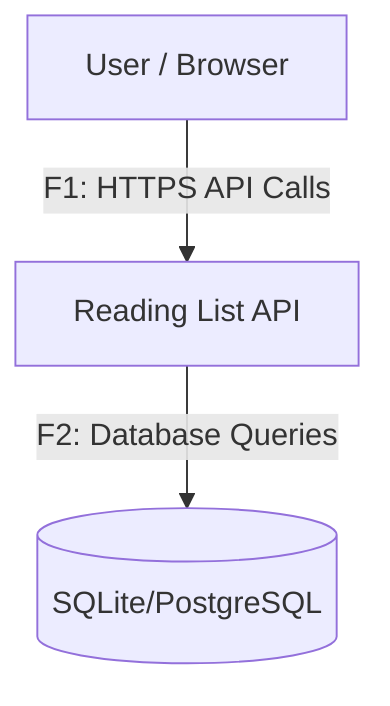
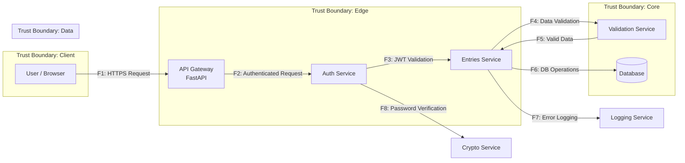
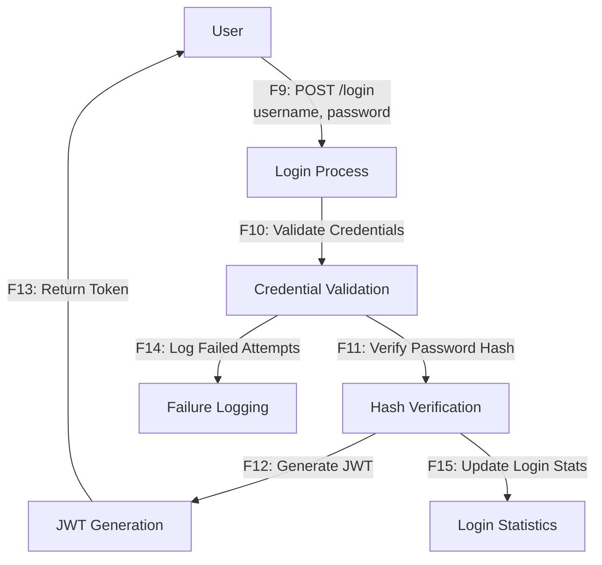

# DFD — Data Flow Diagram

## Контекстная диаграмма

## Логическая архитектура с TB

## Процессы

## Описание потоков даных

| Flow ID |Описание | Канал/Протокол | Данные |
|---------|----------|-----------------|--------|
|F1 | API вызовы от клиента | HTTPS/JSON | Запросы, заголовки |
|F2 | Аутентифицированные запросы | Internal/JSON | JWT, user_id |
|F3| Валидация JWT | Internal | Token verification |
|F4| Валидация данных | Internal | Title, link, kind, status |
|F5| Валидированные данные | Internal | Clean data objects |
|F6| Операции с БД | SQL | Queries, transactions |
|F7| Логирование ошибок | Internal | Error objects, stack traces |
|F8| Верификация паролей | Internal | Hash comparison |
|F9| Запрос на аутентификацию | HTTPS/JSON | username, password |
|F10 | Проверка учетных данных | Internal | Credential validation |
|F11 | Верификация хэша пароля | Internal | Hash comparison |
|F12 | Генерация JWT токена | Internal | Token creation |
|F13 | Возврат токена клиенту | HTTPS/JSON | JWT token |
|F14 | Логирование неудачных попыток | Internal | Failed login data |
|F15 | Обновление статистики логинов | Internal | Login statistics |
